# Wireless and cellular communications
# Simulation Assignment 1
# Bhavesh S (EE23B016)

## Question 1

### Background

Jakes Doppler spectrum takes the form
$$
S_h(f) =
\begin{cases}
\frac{1}{\pi f_d \sqrt{1 - (f/f_d)^2}}, &; |f| \le f_d \\
0, &; \text{otherwise}
\end{cases}
$$

The corresponding autocorrelaton function is given by
$$
R_h(\tau) = J_0(2\pi f_d \tau)
$$

Where $J_0$ represents the 0th order Bessel function

Considering sampling time $T_s$, the required channel autocorrelation becomes
$$
R[m] = J_0(2\pi f_d mT_s)
$$ 

### A) Levison Algorithm

#### Theory
We want to design a linear noise coloring filter that converts a white Gaussian noise into Jakes spectrum.

we want a sequence $h[k]$ such that
$$
\mathbb{E}[h[k]h^*[k+m]] = R[m] = J_0(2\pi f_d mT_s)
$$

Start with: $w[k] \sim \mathcal{CN}(0,1) \quad (\text{i.i.d.})$

We use an auto-regressive(AR) model
$$
h[k] = \sum_{i=1}^{p} a_i\, h[k-i] + w[k]
\qquad(1)
$$


We must choose $a_i$ such that the autocorrelation becomes $R[m]$

$$
\mathbb{E}[h[k] h^*[k-m]] =
\sum_{i=1}^{p} a_i\, \mathbb{E}[h[k-i] h^*[k-m]] + \mathbb{E}[w[k] h^*[k-m]]  \\
R[m] = \sum_{i=1}^{p} a_i R[m-i]
$$
$\because h[k-m]$ depends only on past noise values.
This equation can be solved for $a_i$ efficiently using *levinson-recursion*.  

After obtaining the coefficients $a_i$, $w[k]$ can be passed through a filter to obtain $h[k]$ according to *Eq.1*

#### Results

**Path gain magnitude**
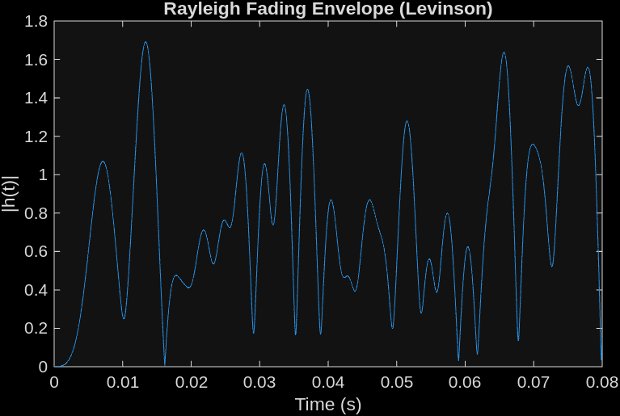

**Autocorrelation**
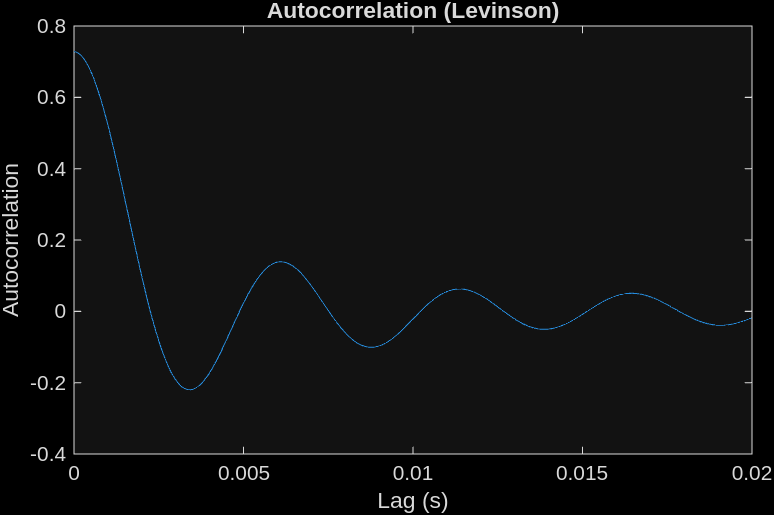
Closely equivalent to 0th order bessel funcion

**Cross correlation**
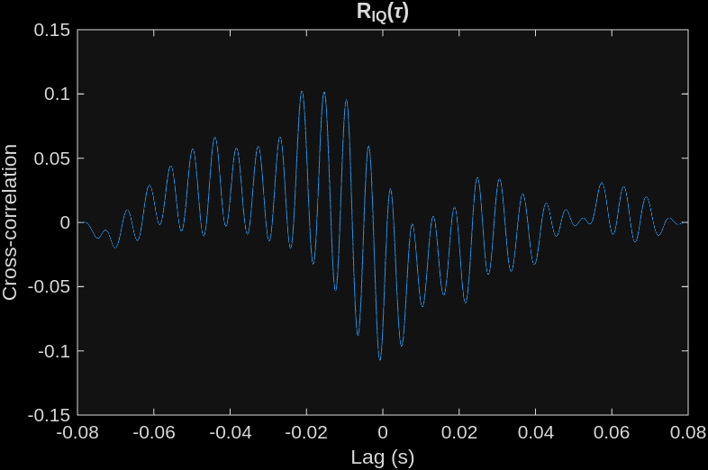
Cross correlation between the real and imaginary parts is low (~0.1) as they are independent.

**PSD**
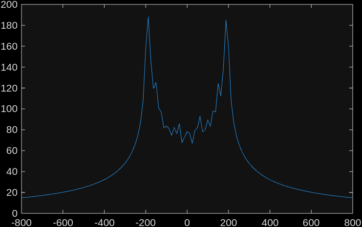
Follows Jake's spectrum

### B) Smith's Model 

#### Theory

Let the Jake's spectrum be $S_E(f)$

Generate complex white gaussian noise in frequency domain.
$$W(f_k​)=W_I​(f_k​)+jW_Q​(f_k​)$$

Multiply by shaping filter
$\sqrt{S_h(f_k)}$
$$H(f_k) = W(f_k) \cdot \sqrt{S_h(f_k)}$$

Take IFFT to get time domain fading
$$h[n] = \text{IFFT} \left\{ \tilde{H}(f_k) \right\}$$

#### Results

**Path gain magnitude**
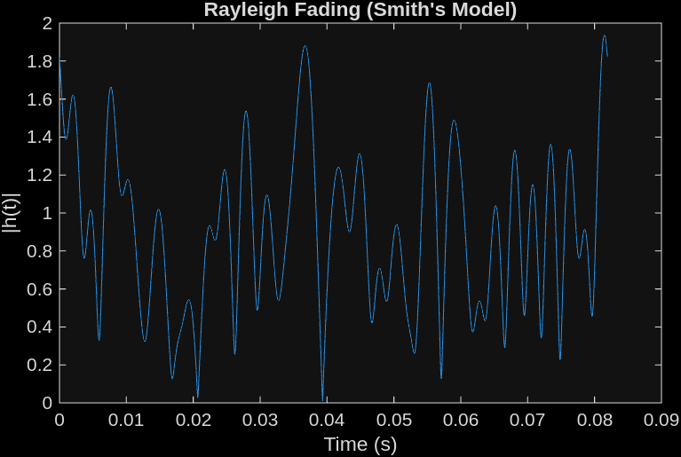

**Autocorrelation**
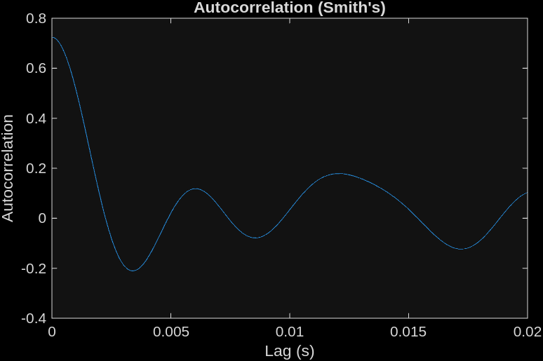

**Cross correlation**
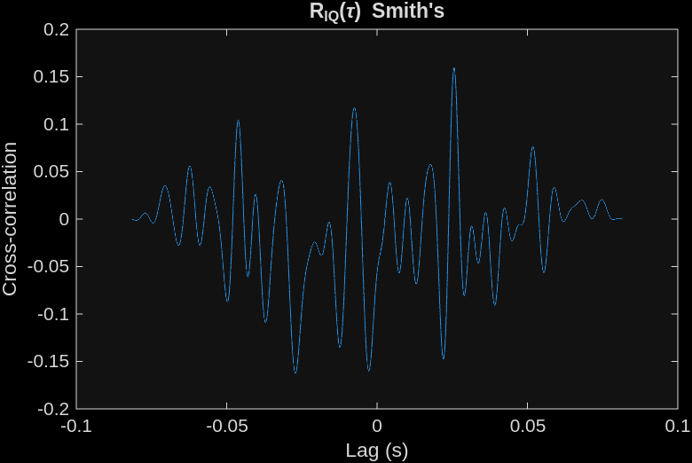

**PSD**
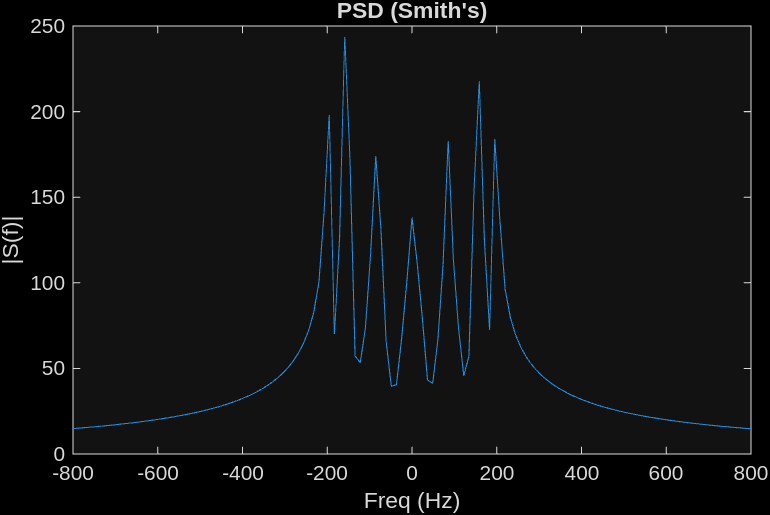

### C) Modified Sum of Sinusoids

#### Theory
Clarke's model models the channel impulse as
$$h(t) = \sum_{n=1}^{N_0} a_n e^{j(2\pi f_n t + \phi_n)}$$

In modified sum of sinusoids, we mimic the clarke's model using
$$h_I(t) = \sum \cos(2\pi f_n t + \phi_n)$$
$$h_Q(t) = \sum \sin(2\pi f_n t + \psi_n)$$
Final model,
$$ h(t) = \sqrt{\frac{2}{N}} \sum_{n=1}^{N}
\Big[
\cos(2\pi f_n t + \phi_n)
+ j \sin(2\pi f_n t + \psi_n)
\Big]
$$
where, 
$$ f_n = f_d \cos(\theta_n)$$

The parameters are distributed as follows
$$\phi_n, \psi_n \sim \mathcal{U}(0, 2\pi)$$
$$\theta_n = \frac{\pi(n - 0.5)}{N}$$

#### Results

**Path gain magnitude**
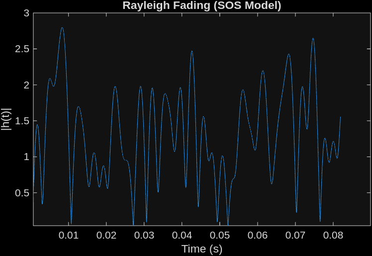

**Autocorrelation**
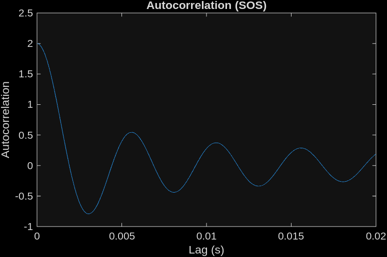

**Cross correlation**
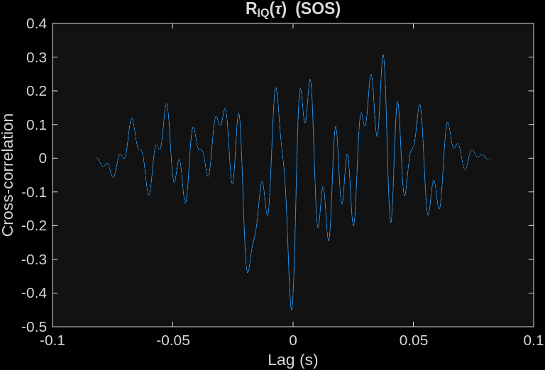

**PSD**
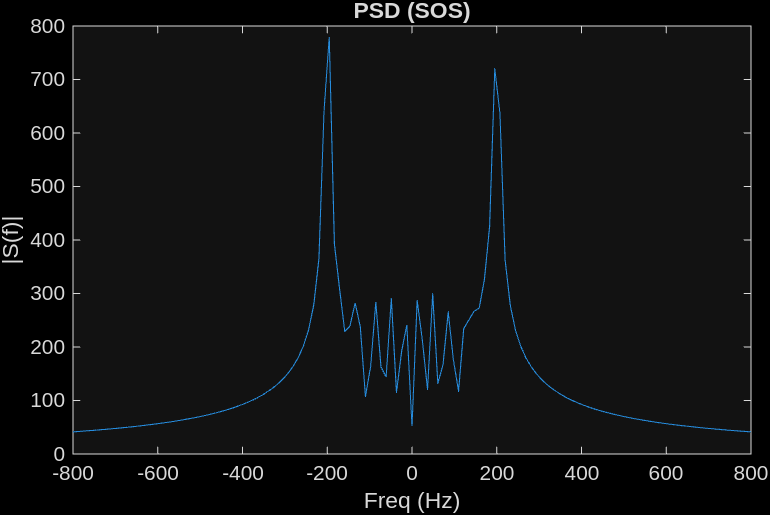

### D) Velocity = 3m/s
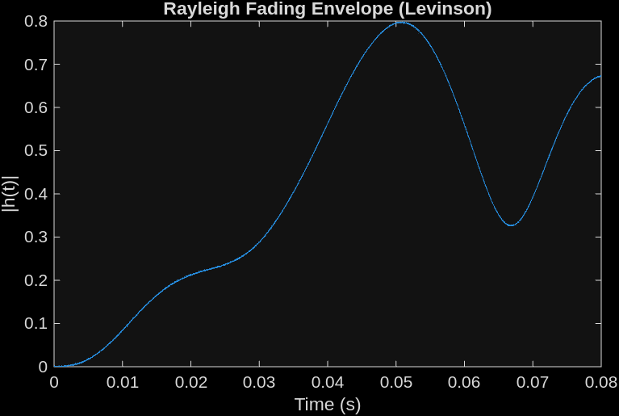

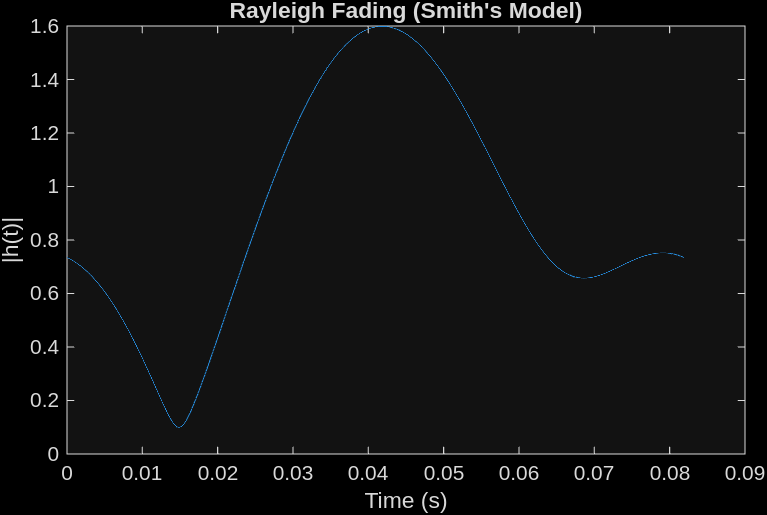
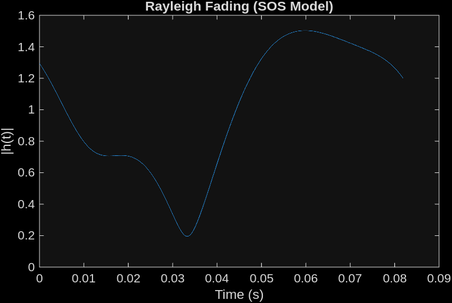

For v=3m/s the channel varies relatively slower with time. Coherence time increases.

## Question 2

Variation of the squared gain in dB with frequency
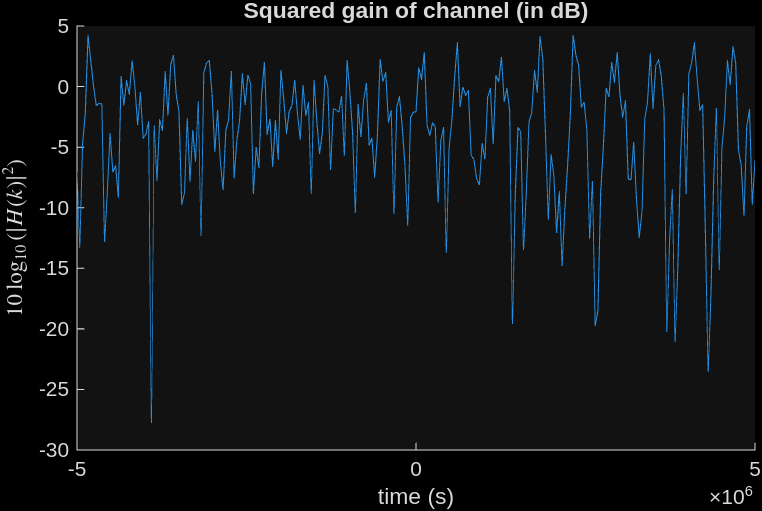

**RMS delay spread**  
Mean delay: $\bar{\tau} = \sum_{i=0}^{L-1} p_i \tau_i$

RMS delay spread is given as 
$$
\tau_{\text{rms}} = \sqrt{ \sum_{i=0}^{L-1} p_i \, (\tau_i - \bar{\tau})^2 }
$$ 

Coherence bandwidth is inversely related to RMS delay spread
$$
B_c \propto \frac{1}{\tau_{\text{rms}}}
$$

For the given PDP, RMS delay spread is calculated to be $2.33\mu s$.

Coherence bandwidth must be in the range of $40kHz$ which is consistent with what is observed in the plot


**Combined plot of three different realizations**
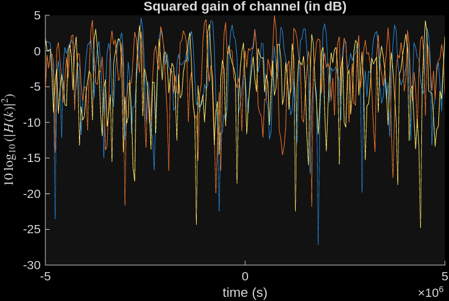


## Question 3
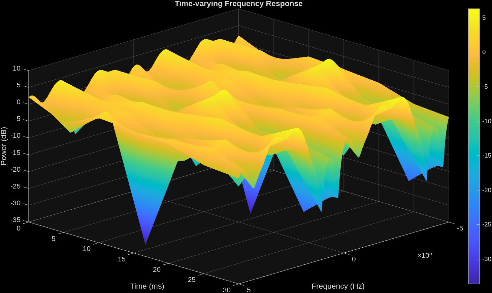
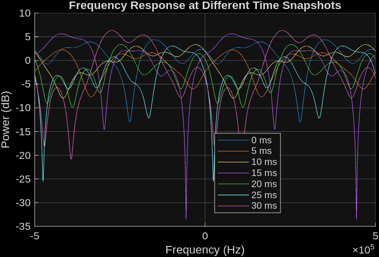

The channel impulse for the first time stamp is generated from the PDP the same was as in question 2. The chanel is assumed to follow clarke's model. Thus consecutive time stamps are generated using Levinson's autoregression model for each delay index in the channel.

## Appendix

1. Levinson's Filter
``` matlab
function h = levinsonFilter(fd, Ts, p, N)
    % --- Theoretical autocorrelation ---
    m = 0:p;
    R = besselj(0, 2*pi*fd*m*Ts);   % Jakes autocorrelation
    R(1) = R(1) + 1e-6;
    
    % --- Levinson-Durbin ---
    [a, E] = levinson(R, p);  % a = [1 a1 ... ap]
    
    % --- Generate white complex Gaussian ---
    w = (randn(1, N) + 1j*randn(1, N))/sqrt(2);
    
    % --- Generate colored process ---
    h = filter(sqrt(E), a, w);
    
end
```

2. Smith's Model

``` matlab

    function [h, t] = smithsFilter(fd, Ts, N)
        df = 1/(N*Ts);
        f  = (-N/2:N/2-1) * df;

        % --- Jakes PSD ---
        S = zeros(1, N);
        idx = abs(f) <= fd;
        
        S(idx) = 1 ./ sqrt(1 - (f(idx)/fd).^2 + eps);  % avoid infinity
        
        % --- Generate complex white Gaussian noise ---
        W = (randn(1,N) + 1j*randn(1,N))/sqrt(2);
        
        % --- Shape spectrum ---
        H = sqrt(S) .* W;
        
        % --- Time domain fading process ---
        h = ifft(ifftshift(H));
        
        % --- Normalize power ---
        h = h / sqrt(mean(abs(h).^2));

        % --- Time axis ---
        t = (0:N-1)*Ts;
    end
```

3. Sum of Sinusoids model
``` matlab
function [h, t] = SOS(fd, Ts, N0, N)
        t = (0:N-1)*Ts;
        
        % angles
        n = 1:N0;
        theta = pi*(n - 0.5)/N0;
        
        % Doppler frequencies
        fn = fd * cos(theta);
        
        % random phases
        phi = 2*pi*rand(1,N0);
        psi = 2*pi*rand(1,N0);
        
        % generate fading
        h = zeros(1,N);
        
        for k = 1:N0
            h = h + ...
                cos(2*pi*fn(k)*t + phi(k)) + ...
                1j*sin(2*pi*fn(k)*t + psi(k));
        end
        
        % normalize
        h = sqrt(2/N0) * h;
    end
```