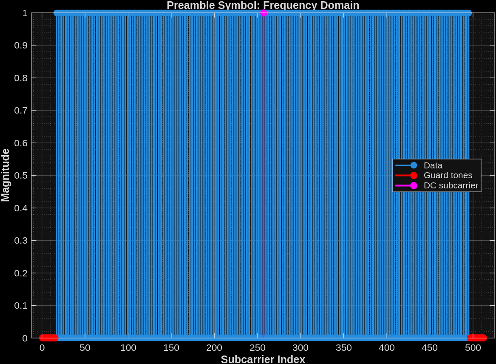
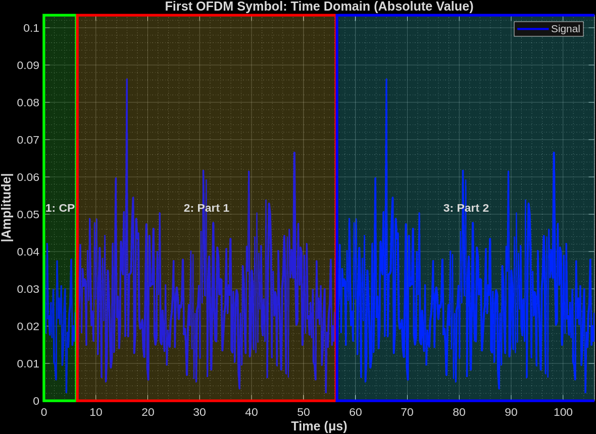
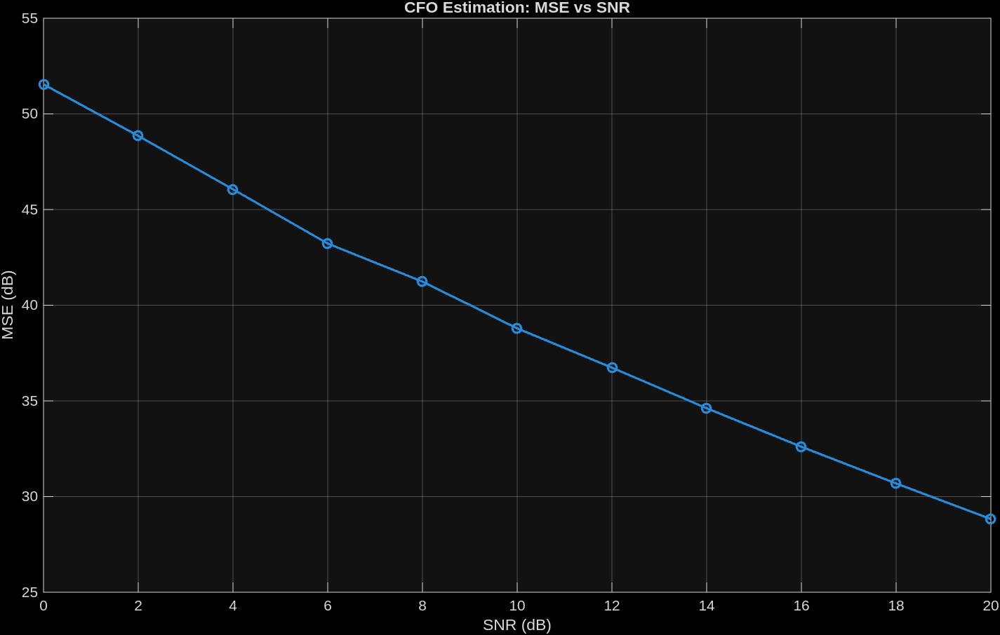
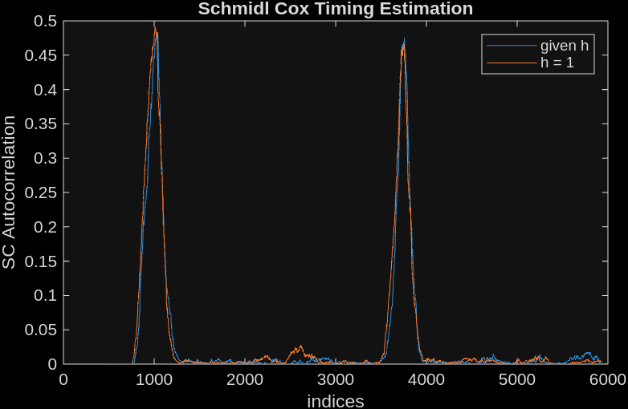
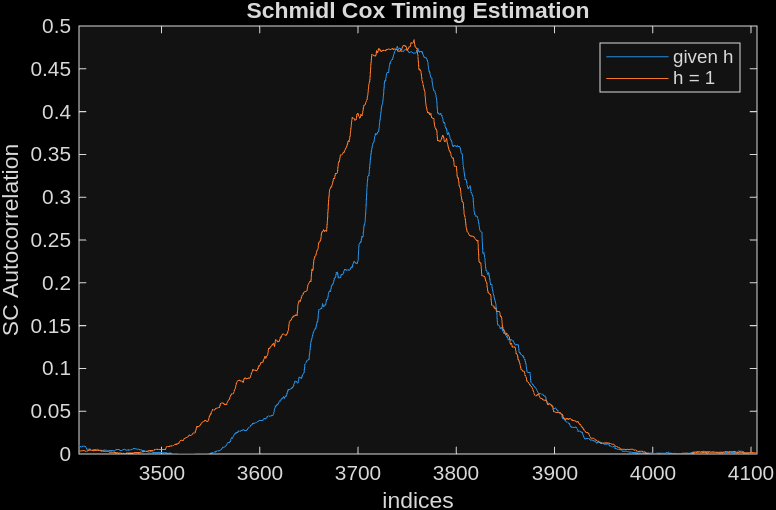
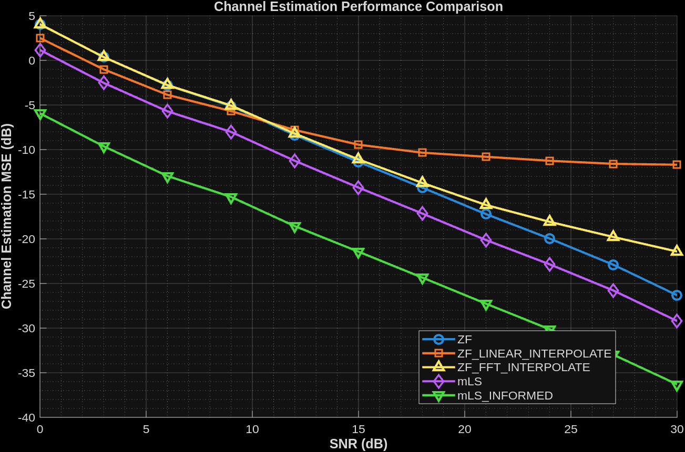

# EE5141 Wireless and Cellular Communication
# Simulation Assignment 2
## Bhavesh Suryanarayanan

## 1. Frequency Synchronization

The preamble uses a Schmidl-Cox structure with QPSK symbols placed at odd subcarriers, creating a symmetric time-domain waveform with N/2-spaced repetition.

**Key Findings:**
- The maximum unambiguous frequency offset that can be detected equals half the subcarrier spacing: $CFO_{\text{max}} = \Delta f / 2 = 5 \text{ kHz}$
- This is because we are computing autocorrelation over N/2 samples
- If the CFO exceeds this limit, aliasing and estimation ambiguity occur
- The provided CFO of 28.65 kHz exceeds this limit and cannot be reliably estimated
- MSE vs SNR is plotted for a reduced CFO of 2.865 kHz (within the unambiguous range)

## 2. Timing Synchronization

The repeating N/2-spaced pattern in the Schmidl-Cox preamble is exploited to estimate timing offset via autocorrelation of the received signal.

For 2 OFDM frames with padded zeros, the normalized autocorrelation plots under different channel conditions (AWGN-only vs. multipath at SNR = 6dB) are shown below:

**Observations:**
- A characteristic plateau appears for each OFDM frame due to the repetition structure
- The AWGN-only case exhibits a wider plateau compared to the multipath channel
- The plateau width is given by: $\text{width} = L_{\text{cp}} - \tau_{\text{max}} + 1$, where $\tau_{\text{max}}$ is the maximum channel delay

## 3. Channel Estimation

Comparative MSE vs SNR performance for five channel estimation methods:

**Observations:**

1. **Zero-Forcing (ZF) Performance:**
   - Basic ZF estimates only at pilot subcarriers; interpolation is required for all subcarriers
   - FFT-based sinc interpolation significantly outperforms linear interpolation by exploiting frequency-domain structure
   - Due to evaluation only at pilot indices, basic ZF shows artificially low MSE

2. **Maximum Likelihood Sequence (MLS) Performance:**
   - Standard MLS outperforms ZF interpolation by utilizing optimal least-squares estimation
   - mLS_informed assumes knowledge of channel tap delays, achieving superior performance

3. **Relative Performance:** mLS_informed > mLS > ZF (FFT interpolation) > ZF (linear) > ZF (pilots only)